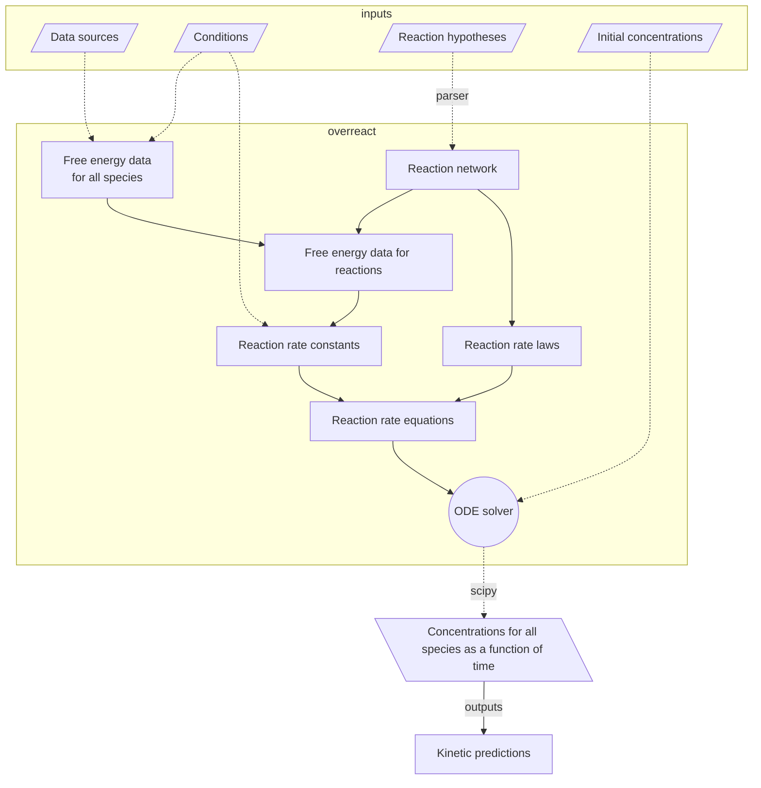

```mermaid {scale: 0.59}
graph TD
    class A,B,C,D,E,F,G,H,data,cond,hypo,init,pred normal

    data[/Data sources/] -.-> A[Free energy data <br> for all species];
    cond[/Conditions/] -.-> E;
    hypo[/Reaction hypotheses/] -.->|parser| G[Reaction network];
    init[/Initial concentrations/] -.-> D;
    cond -.-> A;

    subgraph inputs
        data
        cond
        hypo
        init
    end

    G --> F[Reaction rate laws] --> C[Reaction rate equations];
    A --> B[Free energy data for reactions];
    B --> E[Reaction rate constants] --> C --> D((ODE solver));
    G --> B;

    subgraph overreact
        A
        B
        C
        D
        E
        F
        G
    end

    D -.->|scipy| pred;
    pred -->|outputs| H[Kinetic predictions];


    pred[\Concentrations for all species as a function of time\]
```
